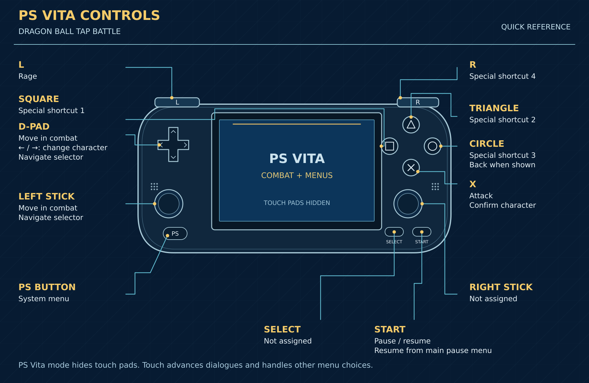

# PS Vita controls — quick reference

An original front-view vector schematic in the launcher's blue, silver and
gold palette. Leader lines terminate on the named physical controls. Text is
English. Current source: [editable SVG](assets/vita-controls-en.svg), 1920 × 1250.
The current diagram omits retired dialogue X. Earlier downloaded PNG versions
may still show that obsolete action; the SVG is the v1.2 reference.

| Physical control | Combat | Other contexts |
|---|---|---|
| D-pad | Eight directions | Left/right change character; navigate launcher |
| Left stick | Eight directions | Navigate launcher |
| X | Attack | Confirm ready character |
| Square | Special shortcut 1 | Other game choices remain touch-operated |
| Triangle | Special shortcut 2 | Launcher also accepts it as back |
| Circle | Special shortcut 3 | Back when original visible button is available; launcher back |
| R | Special shortcut 4 | No additional menu shortcut |
| L | Rage, when available | No additional menu shortcut |
| Start | Pause | Resume from main pause menu |
| Select | Not assigned | Not assigned |
| Right stick | Not assigned | Not assigned |
| PS | System menu | Original system behavior |
| Front touch | Original input | Dialogue advancement, other choices and Yes/No confirmations |

Specials depend on the character and original requirements. In Vita mode,
touch-pad sprites are hidden; real fingers retain input priority. Nested pause
settings return with Circle before Start resumes the main pause menu.
Original tutorial remains touch/gestures. Shortcuts target live original input consumers and require a new press after
scene changes. Dialogue X was retired after Test 5 failed on hardware.
The user approved Circle back in Test 5 and Start resume in the preceding
test; combat, hidden pads and character confirmation were approved earlier. See [Test 5](TEST_VITA_CONTROLS_5.md) and [shortcut audit](VITA_MENU_SHORTCUTS_2026-10-09.md).

This schematic replaces the earlier Spanish decorative reference for current
user guidance. Historical Test 3 artifact identity is preserved in its evidence.
