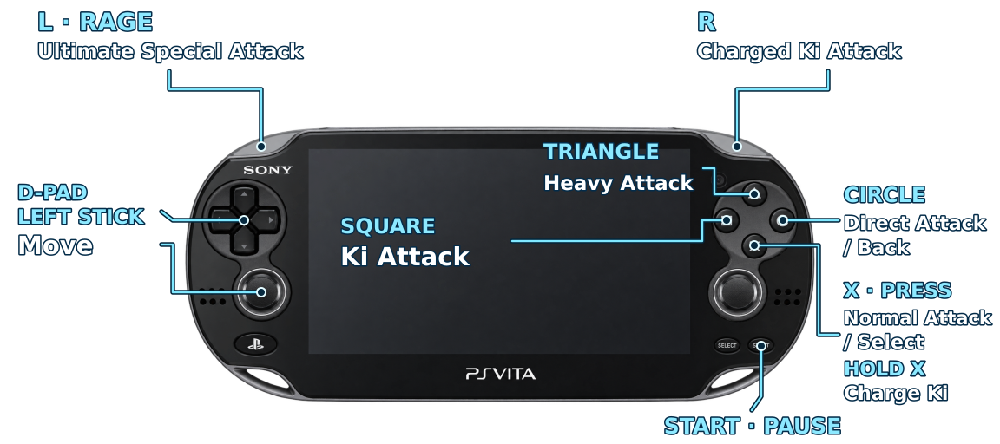

# PS Vita controls — quick reference

<!-- DBTB_DOC_STATUS:START -->
> **Repository status — 2026-10-09:** main contains prepared v1.2 (`01.02` / `DBTB01178`),
> retaining v1.1 and approved Vita controls; dialogues use touch. Exact v1.2 hardware
> retest is pending; published release is 1.1. [Current contract](CURRENT_RUNTIME_CONTRACT.md) · [Status](CURRENT_STATUS.md).
> Current guide; explicitly dated experiments and superseded decisions remain historical.
<!-- DBTB_DOC_STATUS:END -->

The user-approved English diagram has large labels, thin leader lines and no
label boxes, using the launcher's blue/cyan and silver palette. The transparent
PNG is **1152 × 512**, with the console's proportions preserved. It uses the
user's combat action names; availability still depends on the character and
original game requirements. Dialogue X remains retired.

The [earlier editable vector diagram](assets/vita-controls-en.svg) is retained
as a previous reference; the PNG above is the current user-facing illustration.

| Physical control | Combat | Other contexts |
|---|---|---|
| D-pad | Eight directions | Left/right change character; navigate launcher |
| Left stick | Eight directions | Navigate launcher |
| X | Normal attack; hold to charge Ki | Confirm ready character |
| Square | Ki attack (special shortcut 1) | Other game choices remain touch-operated |
| Triangle | Heavy attack (special shortcut 2) | Launcher also accepts it as back |
| Circle | Direct attack (special shortcut 3) | Back when original visible button is available; launcher back |
| R | Charged Ki attack (special shortcut 4) | No additional menu shortcut |
| L | Rage / ultimate special attack, when available | No additional menu shortcut |
| Start | Pause | Resume from main pause menu |
| Select | Not assigned | Not assigned |
| Right stick | Not assigned | Not assigned |
| PS | System menu | Original system behavior |
| Front touch | Original input | Dialogue advancement, other choices and Yes/No confirmations |

Specials depend on the character and original requirements. In Vita mode,
touch-pad sprites are hidden; real fingers retain input priority. Nested pause
settings return with Circle before Start resumes the main pause menu.
Original tutorial remains touch/gestures. Shortcuts target live original input consumers and require a new press after
scene changes. Dialogue X was retired after Test 5 failed on hardware.
The user approved Circle back in Test 5 and Start resume in the preceding
test; combat, hidden pads and character confirmation were approved earlier. See [Test 5](TEST_VITA_CONTROLS_5.md) and [shortcut audit](VITA_MENU_SHORTCUTS_2026-10-09.md).

This schematic replaces the earlier Spanish decorative reference for current
user guidance. Historical Test 3 artifact identity is preserved in its evidence.
